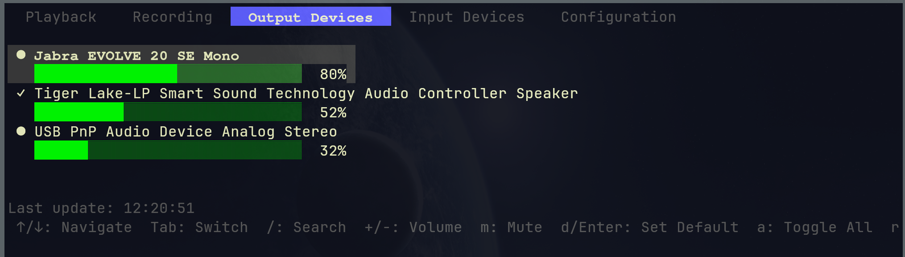
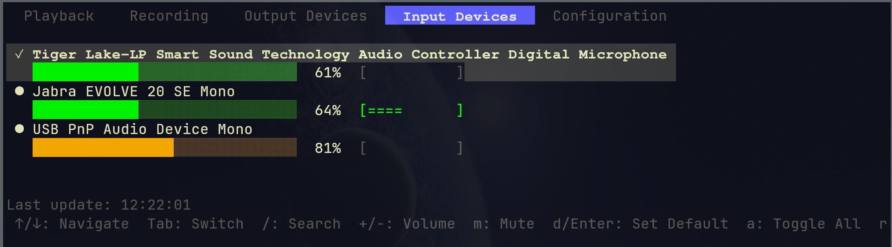
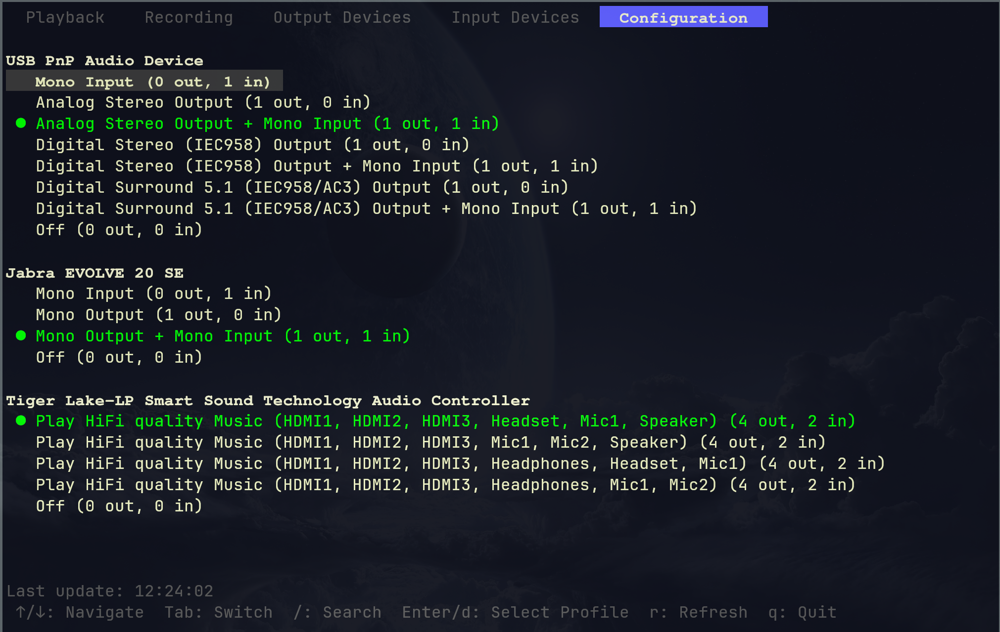

# PulseTUI





A simple and clean TUI (Terminal User Interface) application for managing PulseAudio, inspired by pavucontrol.

## Features

- **Clean interface**: Simplified design compared to pavucontrol for better visual clarity
- **Tab navigation**: Five main tabs
  - Playback: Active audio streams playing
  - Recording: Active recording streams
  - Output Devices: Audio output devices (speakers, headphones)
  - Input Devices: Audio input devices (microphones)
  - Configuration: Sound card profile management
- **Profile configuration**: Switch between different audio profiles for each sound card
  - Change between mono/stereo output modes
  - Enable/disable input or output independently
  - Turn off unused devices to save power
  - Similar to pavucontrol's Configuration tab
- **Smart filtering**: By default, only shows available/usable devices
  - Unavailable devices (e.g., unplugged HDMI) are hidden
  - Monitor sources (e.g., "Monitor of Speaker") are hidden on Input Devices tab
  - Press `a` to toggle showing all devices and monitors
- **Device availability indicators**:
  - `✓` Default device (currently in use)
  - `●` Available device
  - `⊗` Unavailable device (shown only when "Show All" is enabled)
- **Real-time peak level monitoring**: Input devices show live audio level meters
  - Tap your microphone to see which device it is!
  - Color-coded: gray (quiet), green (active), orange (good level), red (clipping)
  - Low CPU usage (~1-2% per monitored device)
- **Device search**: Quick search with `/` key
- **Volume control**: Visual volume bars with +/- keys (color-coded: green/orange/red)
- **Default device selection**: Set default devices with Enter/d
- **Real-time updates**: Immediate refresh on changes + 1-second polling for external updates

## Building

```bash
go build
```

## Running

```bash
./pulsetui
```

## Keyboard Shortcuts

### Navigation
- `Tab` / `→`: Next tab
- `Shift+Tab` / `←`: Previous tab
- `↑` / `k`: Move up one item
- `↓` / `j`: Move down one item
- `PgUp`: Jump up 10 items
- `PgDn`: Jump down 10 items
- `Home` / `g`: Jump to first item
- `End` / `G`: Jump to last item
- `/`: Search mode

### Volume & Device Control
- `+` / `=`: Increase volume (+5%) (Playback, Recording, Devices tabs)
- `-` / `_`: Decrease volume (-5%) (Playback, Recording, Devices tabs)
- `m`: Toggle mute (Playback, Recording, Devices tabs)
- `d` / `Enter`: Set as default (Output/Input Devices tabs) or Select profile (Configuration tab)

### View Options
- `a`: Toggle show all devices (including unavailable)
- `r`: Manual refresh
- `q` / `Ctrl+C`: Quit

## Requirements

- PulseAudio with `pactl` and `parec` commands
- Linux system with PulseAudio running

## How Peak Level Monitoring Works

The peak level meter on the Input Devices tab shows real-time audio levels for each microphone/input device. This makes it easy to identify which physical device is which:

1. Navigate to the "Input Devices" tab
2. Tap or make noise near your microphone
3. Watch the peak meter `[=====     ]` light up in real-time
4. The meter updates 20 times per second for smooth visualization

**Technical details:**
- Uses PulseAudio's monitor sources to capture audio levels
- Optimized with 8kHz sample rate (sufficient for level detection)
- Peak meters only active when viewing Input Devices tab (no overhead otherwise)
- Smooth decay for better visual feedback

## Configuration Tab

The Configuration tab lets you switch between different profiles for each sound card, similar to pavucontrol's Configuration tab.

**What are profiles?**
- Profiles define how a sound card operates (mono vs stereo, input/output combinations)
- Each profile creates different virtual audio devices
- Examples: "Mono Output + Mono Input", "Stereo Output", "Digital Output (S/PDIF)", "Off"

**Usage:**
1. Navigate to Configuration tab
2. Use ↑/↓ to select a profile
3. Press Enter or `d` to activate the selected profile
4. Active profile is marked with `●` in green
5. Unavailable profiles are grayed out

**Common use cases:**
- Switch USB headset between headphones-only and full-duplex (with microphone)
- Select digital vs analog output
- Disable unused sound cards to save power
- Switch between stereo and surround sound modes


